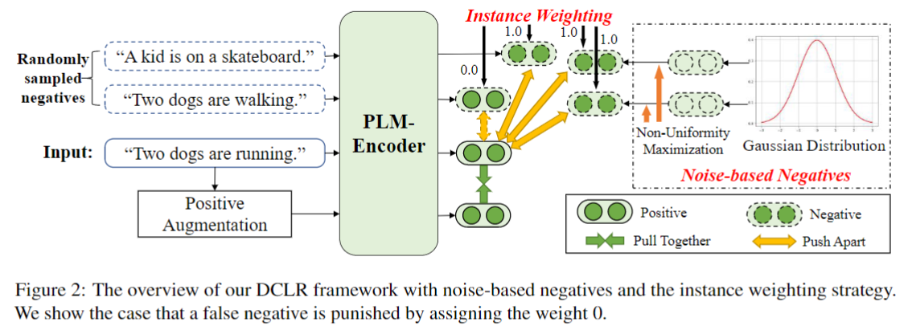

## Debiased Contrastive Learning of Unsupervised Sentence Representations

This repository contains the code for our paper ***Debiased Contrastive Learning of Unsupervised Sentence Representations***.

## Overview

We propose ***DCLR***, a debiased contrastive learning framework for unsupervised sentence representation learning. Based on SimCSE, we mainly consider two biases caused by the randomly negative sampling, namely the false negatives and the anistropy representation problem. For the two problems, we incorporate an instance weighting method and noise-based negatives to alleviate their influence during contrastive learning.



## Train DCLR

In the following section, we describe how to train a DCLR model by using our code.

### Evaluation

Our evaluation code for sentence embeddings is following the released code of [SimCSE](https://github.com/princeton-nlp/SimCSE), it is based on a modified version of [SentEval](https://github.com/facebookresearch/SentEval). It evaluates sentence embeddings on semantic textual similarity (STS) tasks and downstream transfer tasks. For STS tasks, our evaluation takes the "all" setting, and report Spearman's correlation.

Before evaluation, please download the evaluation datasets by running
```bash
cd SentEval/data/downstream/
bash download_dataset.sh
```

### Training

**Data**

We utilize the released data from SimCSE that samples 1 million sentences from English Wikipedia. You can run `data/download_wiki.sh` to download it.

**Required Checkpoints from SimCSE**

In our approach, we require to use a fixed SimCSE on BERT-base and RoBERTa-base as the complementary model for instance weighting. You can download their checkpoints from these links: [SimCSE-BERT-base](https://huggingface.co/princeton-nlp/unsup-simcse-bert-base-uncased) and [SimCSE-RoBERTa-base](https://huggingface.co/princeton-nlp/unsup-simcse-roberta-base).

Besides, we also need the checkpoints of SimCSE on BERT-large and RoBERTa-large to initialize our model for stabilizing the training process. You can download them from these links: [SimCSE-BERT-large](https://huggingface.co/princeton-nlp/unsup-simcse-bert-large-uncased) and [SimCSE-RoBERTa-large](https://huggingface.co/princeton-nlp/unsup-simcse-roberta-large). 

**Training scripts**

We provide the training scripts for BERT/RoBERTa-base/large and have set up the best hyperparameters for training. You can run it to automatically finish the training on BERT/RoBERTa-base/large backbone models.
```bash
bash run.sh
```

For BERT/RoBERTa-base models, we provide a single-GPU (or CPU) example, and for BERT/RoBERTa-large models we give a **multiple-GPU** example. We explain some important arguments in following:
* `--model_name_or_path`: Pre-trained checkpoints to start with. We support BERT-based models (`bert-base-uncased`, `bert-large-uncased`) and RoBERTa-based models (`RoBERTa-base`, `RoBERTa-large`).
* `--c_model_name_or_path`: The checkpoints of Complementary model. We support SimCSE-BERT/RoBERTa-base models (`unsup-simcse-bert-base-uncased`, `unsup-simcse-roberta-base`).
* `--mlp_only_train`: We have found that for BERT/RoBERTa-base, it works better to train the model with MLP layer but test the model without it.


For results in the paper, we use 8 * Nvidia 3090 GPUs with CUDA 11. Using different types of devices or different versions of CUDA/other softwares may lead to slightly different performance.


## Citation

Please cite our paper if you use DCLR in your work:

```bibtex
@article{zhou2021dclr,
   title={Debiased Contrastive Learning of Unsupervised Sentence Representations},
   author={Zhou, Kun and Zhang, Beichen and Zhao, Xin and Wen, Ji-Rong},
   booktitle = {{ACL}},
   year={2022}
}
```